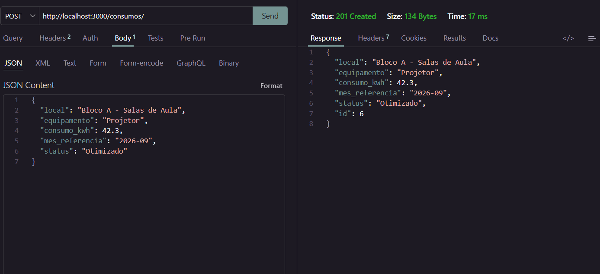
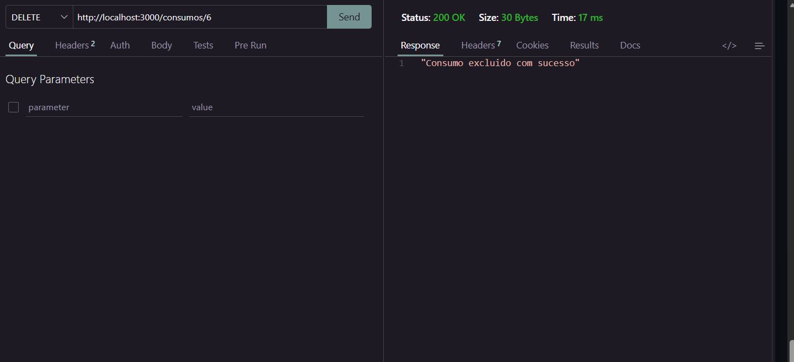
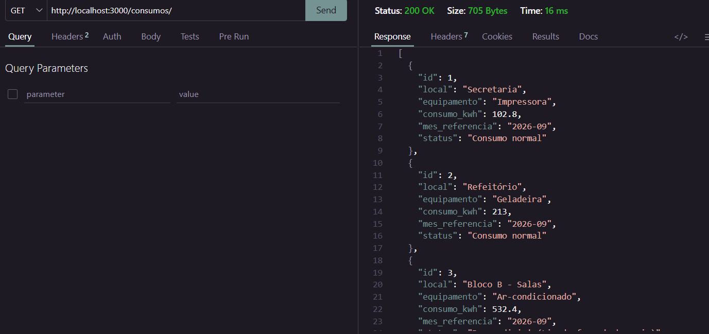
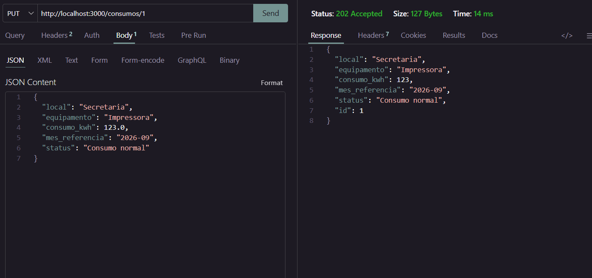
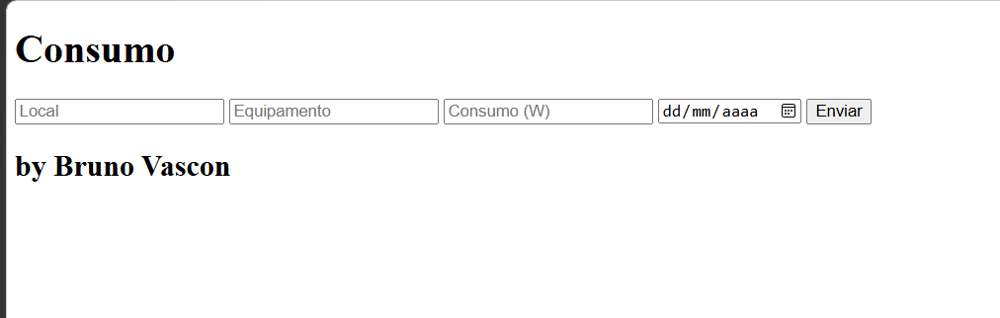
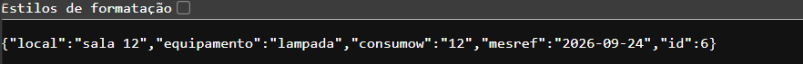

# sesi_pbe1_vps01_consumo_2026

## Tecnologias
- **Node.sj**
- **JavaScript**
- **VsCode**
- **VsCode** Thunder Client

---

## Passos para testar
- 1 Clone este repositório
- 2 Abra com **VsCode** e em um terminal digite:
```bash
npm install
npm run dev
```
- 3 Teste as rotas com a extensão `Thunder Client` do **VsCode**
- 4 Abra o arquivo client/index.html com a extensão `Live Server` do **VsCode**

---

# Prints de teste

<br>
<br>
<br>


# Cliente

<br>
